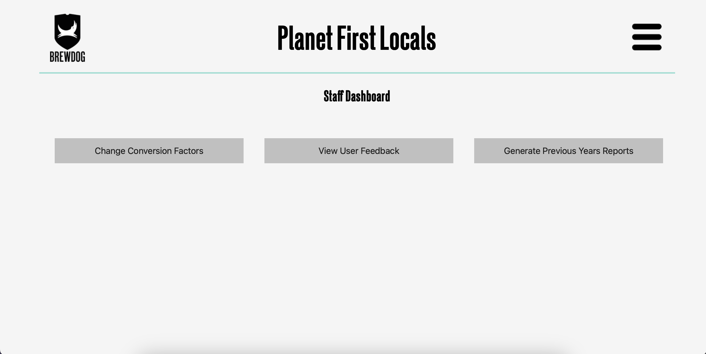

## Planet First Locals Carbon Calculator
This is a website application designed for Brewdog's carbon reduction division, namely Planet First Locals as part of Planet Brewdog. It contains functionality for creation of accounts, storing and displaying of carbon emissions in multiple formats, pledging functionality to allow customers to reduce their overall carbon footprint, as well as general administration features to extract general customer data into an Excel spreadsheet, and to change the carbon emission calculation factors year on year.

## User Guide
When first logging into the website using an administrator account, you should be greeted with the "Staff Dashboard" , which presents three options: 

1. "Change Conversion Factors" brings you to a page with the list of all calculator fields, which you can update with the latest conversion factors for each calculation. The year can be set at the top, which is stored and made available to users when completed. This is stored in the "static/conversion_factors.json" file, so may be manually amended in case of incorrect inputs.

2. "View User Feedback", which presents each submitted customer feedback one after the other, with their rating for each question and a comment they may have left with it regarding the calculator and ease of use. The feedback is all anonymous, allowing the customer to be as honest as they wish.

3. "Generate Previous Years Report" presents a button for each previous year of values available in the calculator (each year set in "Change Conversion Factors"), which allows for administrators to download an excel document combining all carbon calculator inputs by customers for easy viewing and manipulation externally, as well as comparison with previous years usage.

Administrators also have access to all features customers have via the 'dashboard' in the menu dropdown from the top right, which they can use in exactly the same way as customers would.

## Administrator Setup Guide
The project is based on Django, a website building platform using the programming language Python. The implication of this is that this code can be run on any server alongside other software, allowing for easy setup and hosting. The guide below will assume a Linux based operating system, though this is what almost all web hosting servers run on, so should be compatible in many cases.

1. Move the application files onto the server which hosts the website. This can be achieved via either physical access, or a command line interface (CLI) using a command such as "scp" (https://en.wikipedia.org/wiki/Secure_copy_protocol).

2. Navigate to the folder named "pfl-calculator" inside the files, and install required packages using "pip" (https://www.knowledgehut.com/blog/programming/what-is-pip-in-python) with the command "pip install -r requirements.txt".

3. Run "python manage.py migrate". This ensures the website will function correctly with all changes to the database made initially. This may not return any output, but is still good practice to run before starting the site.

4. If wished, an admin user can be created using the command "python manage.py createsuperuser". The program will then go step by step, allowing you to create a username and password for an administrator which has access to the staff only section of the site. This process may be repeated for more accounts if required.

5. The command "python manage.py runserver" will start the server, but only locally. If running on a standalone machine, it is possible to run the server using "python manage.py runserver 0.0.0.0:80", and have the site available using that machine's IP. It is advised to run the server behind a reverse proxy, such as NGINX, which allows a domain name (e.g sh28.lukeog.com) to link to the website, and the website to run on another port, as well as allow SSL (https instead of http) in the website domain.
